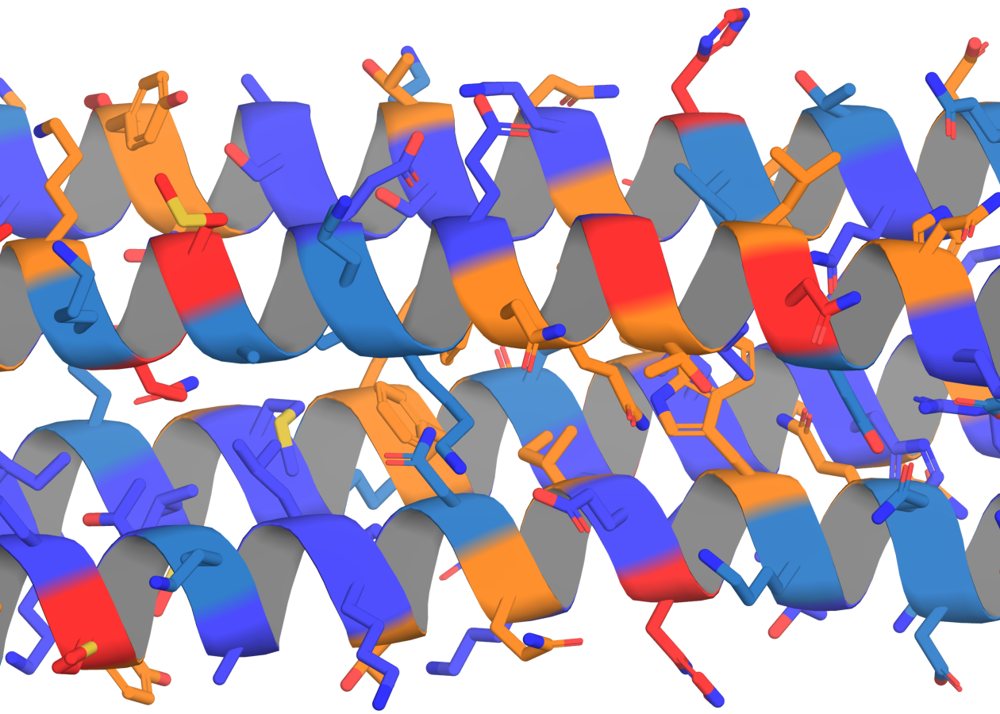

# MPNN Residue Quality Scanner

A simple Python script to score each residue in a PDB file using LigandMPNN or ProteinMPNN, then annotate the B-factor column with the native-AA probabilities provided the surrounding backbone and sequence. This will tell you whether MPNN "agrees" with residue identities given the context.



## Features

- Runs `score.py` (LigandMPNN/ProteinMPNN) to compute single-residue probabilities.
- Extracts the probability of the native amino acid at each position.
- Overwrites the B-factor column in the PDB file with the rounded (3-decimal) native-AA probability.
- Outputs an annotated PDB ready for coloring in PyMOL.

## Installation

1. Clone this repository:
   ```bash
   git clone https://github.com/profdocpizza/MPNN_residue_quality_scanner.git
   cd MPNN_residue_quality_scanner
   ```
2. Install dependencies (requires Python 3.8+):
   ```bash
   pip install torch biopython
   ```

## Usage

```bash
python run_score_and_annotate.py     /path/to/input.pdb     /path/to/output_folder_for_scoring     /path/to/annotated_output.pdb
```

- **input.pdb**: your original PDB file  
- **output_folder_for_scoring**: directory where `score.py` will dump its `.pt` output  
- **annotated_output.pdb**: path for the new PDB with B-factors set to native-AA probabilities  

After running, load the annotated PDB in PyMOL and use:
```pymol
color tv_blue
color skyblue, b < 0.1
color tv_orange, b < 0.08
color tv_red, b < 0.03
```
to visualize low vs. high likelihood regions.

## Configuration

- By default, the script uses the `ligand_mpnn` model. To switch to `protein_mpnn`, edit the `model_type` variable at the top of `run_score_and_annotate.py`.

## License

This project is licensed under the MIT License.
